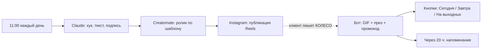

# Салон красоты: «Колесо фортуны» на автопилоте

Два воркфлоу для n8n. После настройки они работают без вашего участия.

| Файл | Что делает |
|---|---|
| `1-content-autopilot.workflow.json` | Каждый день в 11:00: Claude пишет сценарий → Creatomate собирает ролик → ролик выходит в Instagram как Reels |
| `2-direct-wheel-bot.workflow.json` | Бот в директе: на слово «КОЛЕСО» крутит колесо, выдаёт приз и промокод, принимает запись, через 20 часов напоминает о сгорающем подарке |



## Что понадобится

1. **n8n.** Облако n8n.io или свой сервер с публичным HTTPS-адресом.
2. **Instagram — профессиональный аккаунт** (Бизнес или Автор).
3. **Приложение в Meta for Developers** с продуктом *Instagram API with Instagram Login*. Разрешения:
   `instagram_business_basic`, `instagram_business_content_publish`, `instagram_business_manage_messages`.
4. **Ключ API Anthropic** (console.anthropic.com).
5. **Аккаунт Creatomate** (creatomate.com) и ключ API.

## Шаг 1. Шаблон ролика в Creatomate

1. Создайте вертикальный шаблон 1080×1920, длина 15 секунд.
2. Добавьте видео или анимацию колеса, логотип и музыку.
3. Добавьте три текстовых слоя и назовите их **точно так**:
   - `Hook` — большой хук вверху (0–3 сек);
   - `Subtitle` — механика (3–10 сек);
   - `CTA` — призыв «Напиши КОЛЕСО в директ» (10–15 сек).
4. Скопируйте ID шаблона.

## Шаг 2. Учётные данные в n8n

Создайте три учётные записи типа **Header Auth** (*Credentials → Add → Header Auth*):

| Название | Name | Value |
|---|---|---|
| Anthropic | `x-api-key` | ваш ключ Anthropic |
| Creatomate | `Authorization` | `Bearer ВАШ_КЛЮЧ_CREATOMATE` |
| Instagram | `Authorization` | `Bearer ВАШ_ТОКЕН_INSTAGRAM` |

Токен Instagram живёт 60 дней. Продлевайте его или настройте автопродление.

## Шаг 3. Автопостинг Reels

1. Импортируйте `1-content-autopilot.workflow.json` (*Workflows → Import from File*).
2. В узле **«Настройки»** замените название салона, город, призы, ID шаблона и Instagram User ID.
3. В HTTP-узлах выберите учётные данные: «Сценарий от Claude» → Anthropic, узлы Creatomate → Creatomate, узлы Instagram → Instagram.
4. Нажмите *Execute workflow* один раз и проверьте, что ролик вышел.
5. Включите воркфлоу (переключатель *Active*).

## Шаг 4. Бот в директе

1. Импортируйте `2-direct-wheel-bot.workflow.json`.
2. В узле **«Токен верный?»** замените `ПРИДУМАЙТЕ_СВОЙ_VERIFY_TOKEN` на любое своё слово.
3. В узле **«Настройки бота»** укажите ссылку на GIF с колесом, ссылку на онлайн-запись и телефон.
4. В узле **«Напоминание: подарок сгорает»** тоже замените ссылку на онлайн-запись.
5. Во всех узлах отправки сообщений выберите учётные данные Instagram.
6. Включите воркфлоу.
7. Скопируйте *Production URL* узла **«Сообщения из директа (POST)»**.
8. В Meta for Developers → *Webhooks* вставьте этот URL и свой verify token, подпишитесь на поле `messages`.

## Как настроить призы

Откройте узел **«Крутим колесо»** и отредактируйте список `PRIZES`. Число `weight` — это шанс в процентах:

```js
{ title: 'скидка 20% на любую услугу', weight: 40 },
{ title: 'скидка 30% на маникюр или педикюр', weight: 30 },
{ title: 'скидка 50% на любую процедуру', weight: 25 },
{ title: 'бесплатный уход за кожей лица', weight: 5 },
```

## Важно знать

- Каждый клиент крутит колесо **один раз**. Если он напишет «КОЛЕСО» снова, бот напомнит его приз и промокод.
- Бот запоминает клиентов только когда воркфлоу **активен**. При ручном тестовом запуске память не сохраняется.
- Промокоды хранятся внутри воркфлоу. Посмотреть их удобнее, если добавить узел Google Sheets или Telegram после «Крутим колесо» — так администратор будет сразу видеть каждый выигрыш.
- Instagram разрешает боту писать клиенту только в течение 24 часов после его последнего сообщения. Поэтому напоминание уходит через 20 часов.
- Instagram может публиковать не больше 50 постов через API за сутки. Одного ролика в день хватает с запасом.
